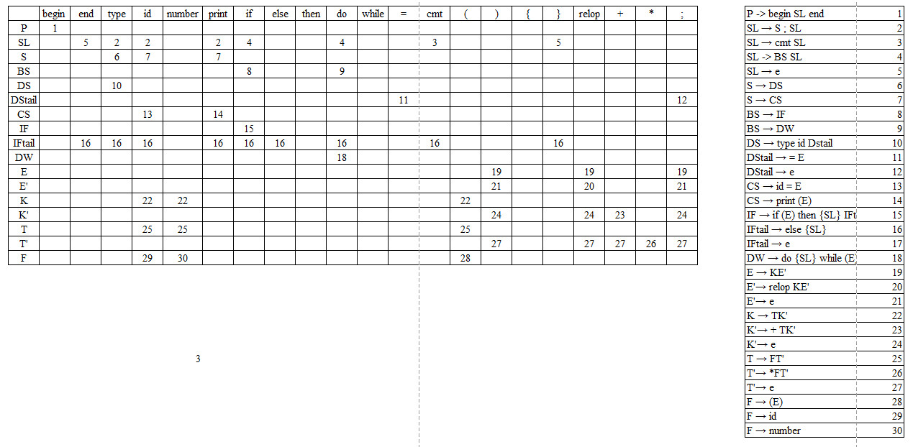

## Context-free grammar for the UPL
### 1. Generative rules
**Some definitions:**
`begin, end, cmt, id, type, print, relop, number, if, else, then, do, while` are terminals, represent following tokens: `<BEGIN, >; <END, >; <COMMENT, >; <ID, ID name>; <TYPE, int|bool>; <PRINT >; <REL_OP, relative operation>; <NUMBER, value>; <IF, >; <ELSE, >; <THEN, >; <DO, >; <WHILE, >` sequentially.
Where:
- `begin, end, print, if, else, then, do, while` are keywords.
- `id` is the token presented variables identify. 
- `type` is either `bool` or `int`, which are types of variables.
- `relop` is relative operator represented `==, >, >=`

Other special character such as `{, }, *, +, (, )` represent themself.
Uppercase symbols are non-terminals.
`e` represents the epsilon character

##### *a. Original rules*
1. `P -> begin SL end`
2. `SL -> S ; SL | BS SL | cmt SL | e`
3. `S -> DS | CS`
4. `BS -> IF | DW`
5. `DS -> type id = E | type id`
6. `CS -> id = E | print (E)`
7. `E -> E relop K | K`
8. `K -> K + T | T`
9. `T -> F * T | F`
10. `F -> (E) | id | number`
11. `IF -> if (E) then {SL} else {SL} | if (E) then {SL}`
12. `DW -> do {SL} while (E)`

##### *b. After handle left factoring*
1. `P -> begin SL end`
2. `SL -> S ; SL | BS SL | cmt SL | e`
3. `S -> DS | CS`
4. `BS -> IF | DW`
5. `DS -> type id = E | type id`
7. `CS -> id = E | print (E)`
8. `E -> E relop K | K`
9. `K -> K + T | T`
10. `T -> F * T | F`
11. `F -> (E) | id | number`
12. `IF -> if (E) then {SL} IFtail`
13. `IFtail -> else {SL} | e`
14. `DW -> do {SL} while (E)`

##### *c. After handle left recursion*
1. `P -> begin SL end`
2. `SL -> S ; SL | BS SL | cmt SL | e`
3. `S -> DS | CS`
4. `BS -> IF | DW`
5. `DS -> type id DStail`
6. `DStail -> = E | e`
7. `CS -> id = E | print (E)`
8. `IF -> if (E) then {SL} IFtail`
9. `IFtail -> else {SL} | e`
10. `DW -> do {SL} while (E)` 
11. `E -> KE'`
12. `E' -> relop KE' | e`
13. `K -> TK'`
14. `K' -> + TK' | e`
15. `T -> FT'`
16. `T' -> * FT' | e`
17. `F -> (E) | id | number` 

### 2. Define FIRST, FOLLOW and FIRST+
##### *a. FIRST*
- `F(F) = {( , id , number}`
- `F(T') = {* , e}`
- `F(T) = F(F) = {( , id , number}`
- `F(K') = {+ , e}` 
- `F(K) = F(T) = {( , id , number}`
- `F(E') = {relop , e}`
- `F(E) = F(K) = {( , id , number}`
- `F(DW) = {do}`
- `F(IFtail) = {else , e}`
- `F(IF) = {if}`
- `F(CS) = {id , print}`
- `F(DStail) = {= , e}`
- `F(DS) = {type}`
- `F(BS) = F(IF) + F(DW) = {if, do}`
- `F(S) = F(DS) + F(CS) = {type , id, print}`
- `F{SL} = F(S) + F(BS) + {cmt , e} = {type, id, print , if , do , cmt , e}`
- `F(P) = {begin}` 

##### *b.FOLLOW*
- `FL(P) = $`
- `FL(SL) = {end ,  } }`
- `FL(S) = {;}`
- `FL(BS) = F(SL) + FL(SL) = {type, id, print , if , do , cmt , e , end, }}`
- `FL(DS) = FL(S) = {;}`
- `FL(DStail) = FL(DS) = {;}`
- `FL(CS) = FL(S) = {;}`
- `FL(IF) = FL(BS) = {type, id, print , if , do , cmt , e , end, }}`
- `FL(IFtail) = FL(IF) = {type, id, print , if , do , cmt , e , end, }}`
- `FL(DW) = FL(BS) = {type, id, print , if , do , cmt , e , end, }}`
- `FL(E) = FL(DStail) + FL(CS) + {)} = {; , )}`
- `FL(E') = FL(E) = {; , )}`
- `FL(K) = F(E') + FL(E) = {relop , e , ; , )}`
- `FL(K') = FL(K) = {relop , e, ; , )}`
- `FL(T) = F(K') + FL(K) = {+ , e , relop , ; , )}`
- `FL(T') = FL(T) = {; , ) , relop , + , e}`
- `FL(F) = F(T') + FL(T) = {+ , relop , ; , ) , * , e }`

##### *c. FIRST+*
- `F+ (P → begin SL end) = {begin}`
- `F+ (SL → S ; SL) = F(S) = {type , id, print}`
- `F+ (SL → cmt SL) = {cmt}`
- `F+ (SL -> BS SL) = F(BS) = {if , do}`
- `F+ (SL → e) = FL(SL) = {end ,  } }`
- `F+ (S → DS) = F(DS) = {type}`
- `F+ (S → CS) = F(CS) = {id , print}`
- `F+ (BS → IF) = F(IF) = {if}`
- `F+ (BS → DW) = F(DW) = {do}`
- `F+ (DS → type id DStail) = {type}`
- `F+ (DStail → = E) = {=}`
- `F+ (DStail → e) = FL(DStail) = {;}`
- `F+ (CS → id = E) = {id}`
- `F+ (CS → print (E)) = {print}`
- `F+ (IF → if (E) then {SL} IFtail) = {if}`
- `F+ (IFtail → else {SL}) = {else}`
- `F+ (IFtail → e) = FL(IFtail) = {type, id, print , if , do , cmt , e , end, }}`
- `F+ (DW → do {SL} while (E)) = {do}`
- `F+ (E → KE') = F(K) = {relop , e , ; , )}`
- `F+ (E'→ relop KE') = {relop}`
- `F+ (E'→ e) = FL(E') = {; , )}`
- `F+ (K → TK') = F(T) = {( , id , number}`
- `F+ (K'→ + TK') = {+}`
- `F+ (K'→ e) = FL(K') = {relop , e, ; , )}`
- `F+ (T → FT') = F(F) = {( , id , number}`
- `F+ (T'→ \*FT') = {\*}`
- `F+ (T'→ e) = FL(T') = {; , ) , relop , + , e}` 
- `F+ (F → (E)) = {(}`
- `F+ (F → id) = {id}`
- `F+ (F → number) = {number}`

### 3. State transition look-up table

 

