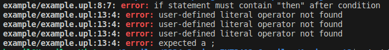

# VNU-UET's Course INT3402 1: Compiler - Assignment 2 - Syntax Analysis

## Authors

- Nguyen Duy Hùng, 21020436, VNU-UET, Computer Engineering Student, Class of 2025 
- Nguyen Thanh An, 21020886, VNU-UET, Computer Engineering Student, Class of 2025
- Nguyen Thu Hiền, 21020141, VNU-UET, Computer Engineering Student, Class of 2025

## Introduction

A simple scanner and a simple token parser for compiling file in the UPL programming language built with the following rules of syntax:
- `begin`, `end`, `if`, `else`, `then`, `do`, `while`, `print`, `int`, `bool` are keywords.
- There are 3 commparison operations: greater than `>`, greater than or equal `>=`, equal `==`. 
- A variable name must start with a letter, any numbers included must be at the end. Example: `a` `a1`, `c33`, `de114` are correct variable names.
- Variables must be declared before use. Variables can be initialized using assignment operators `=`.
- There are 2 arithmetic operations: addition `+`, multiplication `*`.
- Comments are written using `//` for single-line comments or enclosing multi-line comments within `/*` and `*/`.

The grammar for the UPL is shown in `Context-free grammar.md`.

## File structure

- The `Context-free grammar.md` contains definitions for context-free grammar for the UPL.
- Source code included in `./src` folder. Header files are contained in `./include` folder
- `./example` contains the example input file.

## Context-free grammar

- A Statement List `SL` may contain a statement `S`, a block statement `BS`, a comment `cmt` or null `e`. Here, a statement can be a declaration statement `DS` or a computational statement `CS`; while a block statement contains condition `IF` and loop `DW`.
- An expression can be addition `+`, multiplication `*` or comparison `relop`. The order of precedence from highest to lowest is: `*`, `+`, `relop`.  

## How to use

The following examples run the parser with file `./example/example.upl` and save the list of tokens to `./out/output.out` and save the parser tree to `./out/parser_tree.txt`

```
    ./upl example/example.upl ./out/output.out ./out/parser_tree.txt
```
For more details, please use `./upl --helps`

To rebuild and recompile the parser:
   
```
    make all
```
Please take a look to the `Makefile` for more information before changing our source.
    
## Output format

The output list of tokens is formatted as following:
```
<TokenType, Value(Optional)>,
<TokenType, Value(Optional)>,
....
<TokenType, Value(Optional)>
```
If there is an error in the input file, the output file returns the same form of the following example: 


